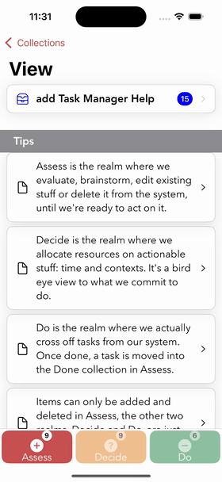
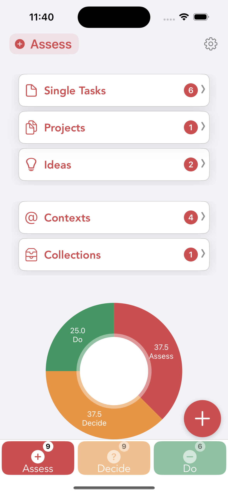
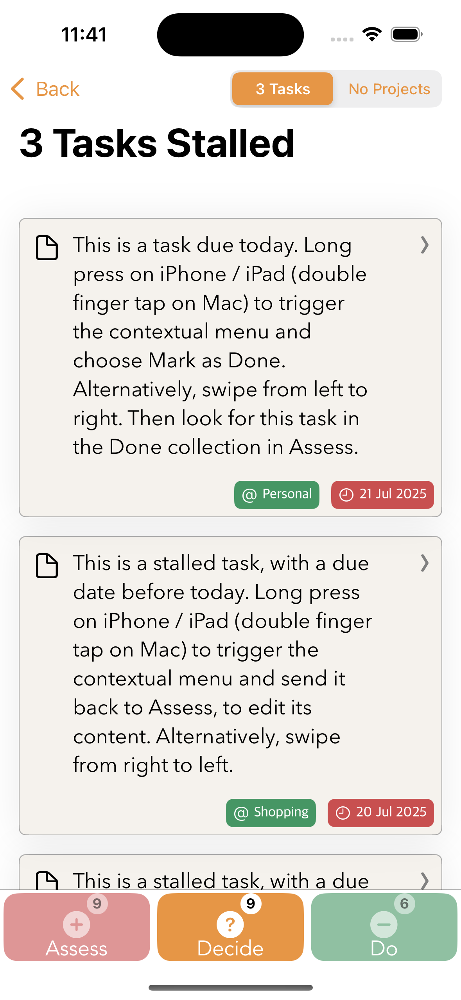
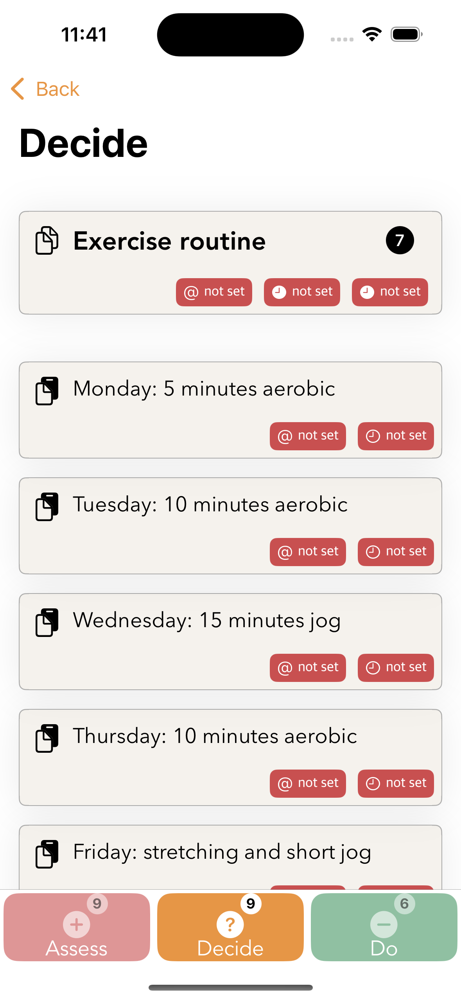
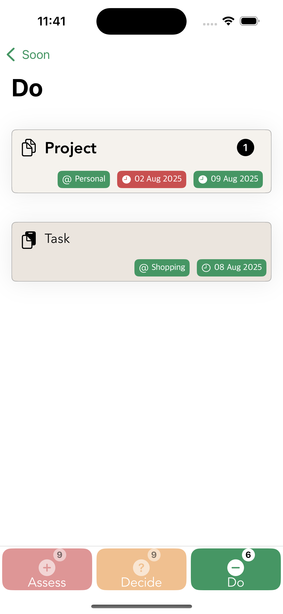

# MetaCellKit

[](https://github.com/dragosroua/MetaCellKit/stargazers)
[](https://github.com/dragosroua/MetaCellKit/blob/main/LICENSE)
[](https://swiftpackageindex.com/dragosroua/MetaCellKit)


A comprehensive, production-ready Swift package that provides a unified, highly configurable table view cell system for iOS apps. MetaCellKit replaces multiple specialized cell classes with a single, parametric solution that supports 0-3 configurable metadata views with automatic date formatting.

## How Did This Happen?

MetaCellKit was born from real-world necessity. Originally developed and extensively refined within [addTaskManager](https://itunes.apple.com/app/apple-store/id1492487688?mt=8), a productivity app based on the Assess - Decide - Do framework, where it powers thousands of task list interactions daily. Through continuous use and iteration in a production environment, MetaCellKit evolved from a simple cell component into a robust, feature-complete solution. The decision to extract and open-source MetaCellKit came from recognizing that many iOS developers face the same challenge: managing multiple specialized table view cells across their apps. What started as an internal solution has now become a universal tool for the iOS development community.

## Examples

### addTaskManager Collection Views


*Showing MetaCellKit's flexible configurations, smooth animations, and master / details layouts in action.*

### Layout Configurations

<p align="center">
  
  
  
  
</p>

*From left to right: Master style in the Assess view, Detail style with 2 metadata views, Detail style with 3 metadata views, and Project view layout demonstrating MetaCellKit's versatility across different content types.*

## Features

### 🏗️ Unified Cell Architecture
- **Single parametric cell class** that replaces multiple specialized cells
- **Card-based design** with master/detail style variants
- **Consistent rounded styling** with shadows and borders
- **Dynamic layout system** that adapts to content

### 🎨 Flexible Styling
- **Master Style**: Subtle styling for list controllers
- **Detail Style**: Enhanced paper-like styling for detail views
- **Parametrizable colors** for metadata views
- **Smooth selection/highlight animations**

### 📊 Content Management
- **Dynamic badges** with auto-sizing for numbers/text
- **SF Symbols support** with tinting
- **UILabel/UITextView** switching for title content
- **0-3 configurable metadata views** with custom colors and icons

### 🤖 Smart Data Binding
- **Generic protocol** works with any data model
- **Automatic date formatting** with multiple styles
- **Reflection-based binding** for flexible content
- **Type-agnostic metadata** content support

### ✏️ In-Place Editing (v1.1.0)
- **Seamless editing mode** with UITextView overlay
- **Dynamic height adjustment** with smooth animations
- **Real-time validation** with customizable rules
- **Character counting** with visual feedback
- **Auto-save functionality** with configurable intervals
- **Keyboard management** with return key handling

### 🎯 Icon Alignment (v1.1.0)
- **Flexible positioning** with top, middle, bottom alignment
- **Dynamic constraints** that adapt to text content
- **Perfect for multi-line text** and varying content heights

## Installation

### Swift Package Manager

Add MetaCellKit to your project using Swift Package Manager:

1. In Xcode, go to **File → Add Package Dependencies**
2. Enter the repository URL: `https://github.com/dragosroua/MetaCellKit`
3. Choose the version and add to your target

Or add it to your `Package.swift`:

```swift
dependencies: [
    .package(url: "https://github.com/dragosroua/MetaCellKit", from: "1.1.0")
]
```

## Quick Start

### Basic Usage

```swift
import MetaCellKit

// In your table view cell configuration
let cell = tableView.dequeueReusableCell(withIdentifier: "MetaCellKit") as! MetaCellKit

// Simple configuration
let taskData = MetaCellKit.TaskData(
    title: "Complete project proposal",
    icon: UIImage(systemName: "doc.text"),
    badge: "3",
    dueDate: Date().addingTimeInterval(86400)
)

cell.configure(with: taskData, metadataViews: 2, style: .detail)
```

### Advanced Configuration

```swift
// Create custom configuration
var config = CellConfiguration()
config.metadataViewCount = 3
config.style = .detail
config.showBadge = true

// Define metadata views
let priorityMetadata = MetadataViewConfig(
    icon: UIImage(systemName: "flag.fill"),
    text: "High",
    backgroundColor: .systemRed,
    textColor: .white
)

let contextMetadata = MetadataViewConfig(
    icon: UIImage(systemName: "at"),
    text: "Work",
    backgroundColor: .systemBlue,
    textColor: .white
)

let statusMetadata = MetadataViewConfig(
    icon: UIImage(systemName: "clock"),
    text: "Due Soon",
    backgroundColor: .systemOrange,
    textColor: .white
)

config.metadataConfigs = [priorityMetadata, contextMetadata, statusMetadata]

// Apply configuration
cell.configure(with: taskData, configuration: config)
```

## Editing Functionality (v1.1.0)

MetaCellKit now supports powerful in-place editing with validation, auto-save, and dynamic height adjustment.

### Basic Editing Setup

```swift
import MetaCellKit

class TaskViewController: UIViewController {
    @IBOutlet weak var tableView: UITableView!
    
    override func viewDidLoad() {
        super.viewDidLoad()
        tableView.register(MetaCellKit.self, forCellReuseIdentifier: "EditableCell")
        tableView.rowHeight = UITableView.automaticDimension
    }
}

// MARK: - Table View Data Source
extension TaskViewController: UITableViewDataSource {
    func tableView(_ tableView: UITableView, cellForRowAt indexPath: IndexPath) -> UITableViewCell {
        let cell = tableView.dequeueReusableCell(withIdentifier: "EditableCell", for: indexPath) as! MetaCellKit
        
        // Configure for editing
        var config = CellConfiguration()
        config.editing.isEditingEnabled = true
        config.editing.maxTextLength = 100
        config.editing.characterCountDisplay = .both
        config.iconAlignment = .top
        
        let taskData = tasks[indexPath.row]
        cell.configure(with: taskData, configuration: config)
        cell.editingDelegate = self
        
        return cell
    }
}

// MARK: - Editing Delegate
extension TaskViewController: MetaCellKitEditingDelegate {
    func cellDidEndEditing(_ cell: MetaCellKit, with text: String) {
        guard let indexPath = tableView.indexPath(for: cell) else { return }
        // Update your data model
        tasks[indexPath.row].title = text
        saveData()
    }
    
    func cell(_ cell: MetaCellKit, willChangeHeightTo height: CGFloat) {
        // Animate height changes
        tableView.beginUpdates()
        tableView.endUpdates()
    }
}
```

### Advanced Editing Configuration

```swift
var config = CellConfiguration()
config.editing.isEditingEnabled = true
config.editing.maxTextLength = 500
config.editing.minTextLength = 3
config.editing.keyboardType = .default
config.editing.returnKeyType = .done
config.editing.autoSaveInterval = 2.0
config.editing.characterCountDisplay = .both
config.editing.placeholderText = "Enter task description..."

// Add validation rules
config.editing.validationRules = [
    LengthValidationRule(min: 3, max: 500),
    RegexValidationRule(pattern: "^[A-Za-z0-9 .,!?-]*$", 
                       message: "Only alphanumeric characters and basic punctuation allowed"),
    CustomValidationRule(message: "Task must contain actionable words") { text in
        let actionWords = ["create", "review", "update", "send", "call", "meet"]
        return actionWords.contains { text.lowercased().contains($0) }
    }
]

cell.configure(with: taskData, configuration: config)
cell.editingDelegate = self

// Enable editing programmatically
cell.enableEditing()
```

### Icon Alignment with Editing

```swift
var config = CellConfiguration()
config.editing.isEditingEnabled = true
config.editing.enablesDynamicHeight = true
config.iconAlignment = .top  // Icon stays at top when text expands

// Perfect for tasks with longer descriptions
let taskData = TaskData(
    title: "Review the quarterly financial reports and prepare summary presentation for the board meeting next week",
    icon: UIImage(systemName: "doc.text.magnifyingglass")
)

cell.configure(with: taskData, configuration: config)
```

### Validation Error Handling

```swift
extension TaskViewController: MetaCellKitEditingDelegate {
    func cell(_ cell: MetaCellKit, validationFailedWith error: ValidationError) {
        // Show user-friendly error message
        let alert = UIAlertController(
            title: "Invalid Input", 
            message: error.message, 
            preferredStyle: .alert
        )
        alert.addAction(UIAlertAction(title: "OK", style: .default))
        present(alert, animated: true)
        
        // Keep editing active to allow corrections
        // Cell automatically stays in editing mode when validation fails
    }
    
    func cell(_ cell: MetaCellKit, didAutoSaveText text: String) {
        // Handle auto-save
        guard let indexPath = tableView.indexPath(for: cell) else { return }
        tasks[indexPath.row].title = text
        // Save to persistent storage
        autosaveData()
    }
}
```

### Programmatic Text Management

```swift
// Get current text
let currentText = cell.getText()

// Set text programmatically
cell.setText("Updated task title")

// Check if cell is currently being edited
if cell.isEditing {
    // User is currently editing
    cell.commitEditing()  // Save changes
    // or
    cell.cancelEditing()  // Discard changes
}
```

## Layout Variants

### Basic Layout
Icon + Title + Badge + Disclosure indicator

```swift
let config = MetaCellKit.basicConfiguration(style: .master)
cell.configure(with: data, configuration: config)
```

### Single Metadata
Basic layout + 1 configurable metadata view

```swift
cell.configure(with: data, metadataViews: 1, style: .detail)
```

### Dual Metadata
Basic layout + 2 configurable metadata views

```swift
let config = MetaCellKit.dualMetadataConfiguration(style: .detail)
cell.configure(with: data, configuration: config)
```

### Triple Metadata
Basic layout + 3 configurable metadata views

```swift
let config = MetaCellKit.tripleMetadataConfiguration(style: .master)
cell.configure(with: data, configuration: config)
```

## Style System

### Master Style
- Subtle borders and system backgrounds
- Ideal for master list controllers
- Minimal spacing and gentle shadows

### Detail Style
- Paper-like backgrounds with enhanced shadows
- Perfect for detail views and secondary lists
- Increased spacing and visual depth

## Automatic Date Formatting

MetaCellKit automatically detects `Date` properties in your data models and formats them appropriately:

```swift
struct TaskData: CellDataProtocol {
    let title: String
    let dueDate: Date        // Automatically formatted as "15 Jan 2024"
    let createdDate: Date    // Automatically formatted as "2h ago"
}

// Multiple date format styles available
let formatter = DateFormattingUtility.shared
formatter.formatDate(date, style: .short)    // "15 Jan"
formatter.formatDate(date, style: .medium)   // "15 Jan 2024"
formatter.formatDate(date, style: .relative) // "2h ago"
```

## Creating Custom Data Models

Implement the `CellDataProtocol` for automatic data binding:

```swift
struct MyTaskData: CellDataProtocol {
    let title: String           // Automatically bound to title
    let icon: UIImage?          // Automatically bound to icon
    let badge: String?          // Automatically bound to badge
    let dueDate: Date?          // Automatically formatted and bound to metadata
    let priority: String?       // Bound to available metadata views
    let context: String?        // Bound to available metadata views
}
```

## Components

### MetaCellKit
The main cell class that handles all layout variants and configurations.

### CellConfiguration
Configuration struct that defines:
- Layout variant (0-3 metadata views)
- Style variant (master/detail)
- Visibility options (badge, disclosure)
- Metadata view configurations

### MetadataViewConfig
Defines appearance of metadata views:
- Icon and text content
- Background and text colors
- Corner radius and font

### DynamicBadgeLabel
Auto-sizing badge component with:
- Automatic width calculation
- Support for numbers and text
- Customizable colors and minimum size

### DateFormattingUtility
Automatic date formatting with multiple styles:
- Short, medium, long formats
- Relative time formatting
- Consistent formatting across the app

## Table View Integration

### Cell Registration

```swift
// Register the cell
tableView.register(MetaCellKit.self, forCellReuseIdentifier: "MetaCellKit")

// In cellForRowAt
let cell = tableView.dequeueReusableCell(withIdentifier: "MetaCellKit", for: indexPath) as! MetaCellKit
let data = yourDataArray[indexPath.row]
cell.configure(with: data, metadataViews: 2, style: .detail)
return cell
```

### Dynamic Height Support

```swift
// Enable automatic dimension for dynamic height
tableView.rowHeight = UITableView.automaticDimension
tableView.estimatedRowHeight = 80
```

## Migration Guide

### From Multiple Cell Classes

If you're currently using multiple specialized cell classes:

1. **Replace cell classes** with `MetaCellKit`
2. **Convert cell data** to conform to `CellDataProtocol`
3. **Create configurations** that match your existing designs
4. **Update table view** registration and dequeue calls

### Example Migration

```swift
// Before: Multiple cell classes
class BasicTaskCell: UITableViewCell { ... }
class DetailTaskCell: UITableViewCell { ... }
class PriorityTaskCell: UITableViewCell { ... }

// After: Single MetaCellKit with configurations
let basicConfig = MetaCellKit.basicConfiguration()
let detailConfig = MetaCellKit.singleMetadataConfiguration(style: .detail)
let priorityConfig = MetaCellKit.dualMetadataConfiguration()
```

### Migrating to v1.1.0 from v1.0.x

MetaCellKit v1.1.0 is **100% backward compatible**. All existing code continues to work without changes.

#### Existing Code (v1.0.x) - Still Works
```swift
// Your existing v1.0.x code continues to work unchanged
let cell = tableView.dequeueReusableCell(withIdentifier: "cell") as! MetaCellKit
cell.configure(with: taskData, metadataViews: 2, style: .detail)
```

#### New Features Available
```swift
// Optional: Upgrade to new configuration system for editing features
var config = CellConfiguration()
config.metadataViewCount = 2
config.style = .detail

// NEW: Add editing capabilities
config.editing.isEditingEnabled = true
config.editing.maxTextLength = 200

// NEW: Add icon alignment
config.iconAlignment = .top

cell.configure(with: taskData, configuration: config)
cell.editingDelegate = self  // NEW: Set editing delegate
```

#### What's New in v1.1.0
- ✅ **No breaking changes** - all existing APIs preserved
- 🆕 **Editing functionality** - opt-in via configuration
- 🆕 **Icon alignment** - `.top`, `.middle`, `.bottom` options
- 🆕 **Validation rules** - customizable text validation
- 🆕 **Auto-save** - configurable intervals
- 🆕 **Dynamic height** - automatic adjustment during editing

#### Gradual Migration Strategy
1. **Keep existing code** - no immediate changes needed
2. **Identify editing candidates** - cells that would benefit from editing
3. **Migrate incrementally** - convert one screen at a time
4. **Test thoroughly** - new features are opt-in and safe

## Performance

MetaCellKit is optimized for:
- **Cell reuse**: Efficient `prepareForReuse` implementation
- **Memory management**: Minimal object allocation
- **Layout performance**: Constraint-based layout with caching
- **Smooth scrolling**: Optimized for large datasets

## Troubleshooting

### Common Editing Issues

#### Cell Height Not Updating During Editing
```swift
// ✅ Solution: Ensure dynamic height is enabled and delegate is implemented
var config = CellConfiguration()
config.editing.enablesDynamicHeight = true

// Implement the delegate method
func cell(_ cell: MetaCellKit, willChangeHeightTo height: CGFloat) {
    tableView.beginUpdates()
    tableView.endUpdates()
}

// Ensure table view supports dynamic height
tableView.rowHeight = UITableView.automaticDimension
tableView.estimatedRowHeight = 80
```

#### Editing Not Starting
```swift
// ✅ Check these common issues:

// 1. Editing must be enabled in configuration
config.editing.isEditingEnabled = true

// 2. Delegate must be set
cell.editingDelegate = self

// 3. Make sure you're calling enableEditing()
cell.enableEditing()
```

#### Validation Errors Not Showing
```swift
// ✅ Implement the validation delegate method
func cell(_ cell: MetaCellKit, validationFailedWith error: ValidationError) {
    // Show error to user - this method won't be called automatically
    showAlert(message: error.message)
}

// ✅ Validation rules must be added to configuration
config.editing.validationRules = [
    LengthValidationRule(min: 1, max: 100)
]
```

#### Auto-Save Not Working
```swift
// ✅ Ensure both methods are implemented
func cell(_ cell: MetaCellKit, didAutoSaveText text: String) {
    // Handle the auto-save
    saveData(text)
}

func cellShouldAutoSave(_ cell: MetaCellKit) -> Bool {
    // Return true to allow auto-save
    return true
}

// ✅ Set auto-save interval
config.editing.autoSaveInterval = 2.0  // Save every 2 seconds
```

#### Keyboard Not Dismissing
```swift
// ✅ Handle return key properly
func cellShouldReturn(_ cell: MetaCellKit) -> Bool {
    // Return true to dismiss keyboard and end editing
    return true
}

// ✅ Or dismiss programmatically
cell.disableEditing()  // Commits changes and dismisses keyboard
cell.cancelEditing()   // Reverts changes and dismisses keyboard
```

### Performance Tips

- **Reuse cells properly**: Always use `dequeueReusableCell`
- **Limit metadata views**: Use 0-3 metadata views for optimal performance
- **Optimize validation**: Keep validation rules simple and fast
- **Auto-save frequency**: Don't set auto-save intervals too low (< 1 second)

### Best Practices

- **Validation feedback**: Always implement `validationFailedWith` delegate method
- **Height animations**: Use `willChangeHeightTo` for smooth table view updates  
- **Data persistence**: Implement both `didEndEditing` and `didAutoSaveText`
- **Error handling**: Gracefully handle validation errors with user-friendly messages
- **Icon alignment**: Use `.top` alignment for cells with long, multi-line text

## Requirements

- iOS 13.0+
- Swift 5.7+
- Xcode 14.0+

## Sample Projects

Check out the included sample data and configurations:

```swift
// Use sample data for testing
let sampleTasks = MetaCellKitSampleData.sampleTasks()
let sampleConfigs = MetaCellKitSampleData.sampleConfigurations()

// Quick testing in your table view
cell.configure(with: sampleTasks[0], configuration: sampleConfigs[2])
```

## License

MetaCellKit is available under the MIT license. See [LICENSE](LICENSE) for details.

## Contributing

We welcome contributions! Please:

1. Fork the repository
2. Create a feature branch
3. Add tests for new functionality
4. Ensure all tests pass
5. Submit a pull request

## Support

- 📖 [Documentation](Documentation/)
- 🐛 [Issues](https://github.com/dragosroua/MetaCellKit/issues)
- 💬 [Discussions](https://github.com/dragosroua/MetaCellKit/issues)

## Apps Using MetaCellKit

MetaCellKit is actively used in production apps, powering thousands of user interactions daily:

- **[addTaskManager](https://itunes.apple.com/app/apple-store/id1492487688?mt=8)** - A comprehensive task management app where MetaCellKit originated. Used throughout the app for task lists, project views, and settings screens, handling complex metadata display including priorities, due dates, contexts, and progress indicators.

*Using MetaCellKit in your app? [Let us know](https://github.com/dragosroua/MetaCellKit/issues) and we'll add it to this list!*

---

**MetaCellKit** - One cell to rule them all. ✨